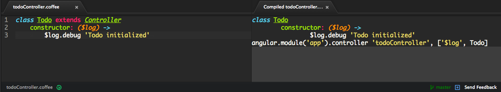

# ng-classify for [Atom](https://atom.io/) [![Version][version-image]][version-url] [![Build Status][build-image]][build-url] [![Dependency Status][dependencies-image]][dependencies-url] [![devDependency Status][dev-dependencies-image]][dev-dependencies-url]
> Snippets for converting CoffeeScript classes to [AngularJS](http://angularjs.org/) modules with [ng-classify](https://github.com/CaryLandholt/ng-classify)



Go to `Packages > ng-classify > Compile` to see the ng-classified version


## Table of Contents
* [Installing](#installing)
* [Snippets](#snippets)
* [Contributing](#contributing)
* [Changelog](#changelog)
* [License](#license)


## Installing
```bash
$ apm install ng-classify
```


## Snippets
* [ng-app](https://github.com/CaryLandholt/ng-classify/blob/master/README.md#app)
* [ng-animation](https://github.com/CaryLandholt/ng-classify/blob/master/README.md#animation)
* ng-backend (Similar to [ng-run](https://github.com/CaryLandholt/ng-classify/blob/master/README.md#run), but with backend boilerplate)
* [ng-config](https://github.com/CaryLandholt/ng-classify/blob/master/README.md#config)
* [ng-constant](https://github.com/CaryLandholt/ng-classify/blob/master/README.md#constant)
* [ng-controller](https://github.com/CaryLandholt/ng-classify/blob/master/README.md#controller)
* [ng-directive](https://github.com/CaryLandholt/ng-classify/blob/master/README.md#directive)
* [ng-factory](https://github.com/CaryLandholt/ng-classify/blob/master/README.md#factory)
* [ng-filter](https://github.com/CaryLandholt/ng-classify/blob/master/README.md#filter)
* [ng-provider](https://github.com/CaryLandholt/ng-classify/blob/master/README.md#provider)
* ng-router (Similar to [ng-config](https://github.com/CaryLandholt/ng-classify/blob/master/README.md#config), but with router boilerplate)
* [ng-run](https://github.com/CaryLandholt/ng-classify/blob/master/README.md#run)
* [ng-service](https://github.com/CaryLandholt/ng-classify/blob/master/README.md#service)
* [ng-value](https://github.com/CaryLandholt/ng-classify/blob/master/README.md#value)


## Contributing
See [CONTRIBUTING.md](CONTRIBUTING.md)


## Changelog
See [CHANGELOG.md](CHANGELOG.md)


## License
See [LICENSE](LICENSE)


[build-image]:            https://secure.travis-ci.org/CaryLandholt/atom-ng-classify.svg
[build-url]:              http://travis-ci.org/CaryLandholt/atom-ng-classify

[dependencies-image]:     https://david-dm.org/CaryLandholt/atom-ng-classify.svg
[dependencies-url]:       https://david-dm.org/CaryLandholt/atom-ng-classify

[dev-dependencies-image]: https://david-dm.org/CaryLandholt/atom-ng-classify/dev-status.svg
[dev-dependencies-url]:   https://david-dm.org/CaryLandholt/atom-ng-classify#info=devDependencies

[version-image]:          https://badge.fury.io/gh/CaryLandholt%2Fatom-ng-classify.svg
[version-url]:            http://badge.fury.io/gh/CaryLandholt%2Fatom-ng-classify